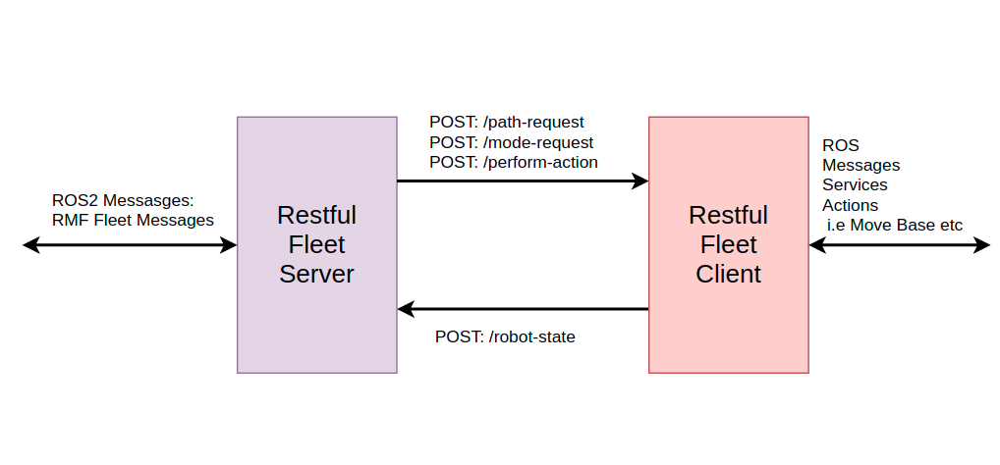

# RESTFUL FLEET MANAGER

## About
`restful fleet` is a fleet manager package for [`RMF`](https://github.com/open-rmf/rmf). The implementation of this package is largely based on [`free fleet`](https://github.com/open-rmf/free_fleet). `free fleet` uses DDS as its middleware to communicate between the server and client. However, it can be cumbersome to allow DDS packets to be transferred across the Wide Area Network. Threfore the middleware implementation of `restful fleet` is using restful http requests.



## Installation
```
cd <ws_path>/src
git clone https://github.com/Capstone-S13/restful_fleet.git
cd <ws_path>
colcon build --symlink-install
```

## Running Restful Fleet
Before running the restful fleet client, be sure to run your robot's navigation stack with its movebase server.
```
cd <ws_path>
source install/setup.bash
rosrun restful_fleet_client main.py
```


## For Developers

There are four main classes in the restful fleet package.
* Server
* ServerNode
* Client
* ClientNode

### Server and Client
The middleware specific components and methods are encapsulated within the `Server` and `Client` classes. In the case of `restful fleet` this refers to the flask app and the methods for making restful requests.

### ServerNode
The `ServerNode` contains the ROS publishers, subscribers to publish and subscribe relevant information to and from the fleet adapter. The most basic function of the `ServerNode` is to publish it's fleet's `robot_state` into the`fleet states` topic and relay the `path request` and `mode request` to the robot client.


### ServerNode and ClientNode
Likewise, the `ServerNode` contains ROS specific classes and callback functions. The `ClientNode` contains the publishers, subscribers, action client, action servers required determin the robot's state as well as to command the robot to carry out necessary tasks.

### Support for Perform Action
The `restful fleet` has support for perform action. However this requires fleet adapter's `ActionExecutor` to be implemented in a specific manner. The fleet adapter is required to publish a json messsage containing the information mentioned below, in the form of `std_msgs/String`, to the `<robot name>/perform_action` topic.

The json message should have the following attributes:
* description
* category
* robot

1. `description`
    The data necessary for the execution of the action should be contained in the `description` attribute of the [perform action schema](https://raw.githubusercontent.com/open-rmf/rmf_ros2/main/rmf_fleet_adapter/schemas/event_description__perform_action.json). The `restful_fleet_server`.

2. `category`
    The value of the category attribute would be the string name of the action that is to be performed.

3. `robot`
    The value of this attribute is the string name of the robot to perform the action.

The `restful_fleet_server` would be subscribing to the `<robot name>/perform_action` topic. The information would be relayed to `restful_fleet_client`. The `restful_fleet_client` would then extract the information from the json message's `description` and `category` attribute to carry out the action.
The default implementation uses the `getattr` method in python.
i.e
```python
category = json_msg['category']
action = getattr(ClientNode, category)
action()
```
Therefore the method in for the action should be named according to the `category` of the action.


## Future Improvements
* Multi client discovery.
* ROS2 version of restful fleet client
* More efficient method of calling map service